<!--
  ┌──────────────────────────────────────────────────────────────────┐
  │  This is your GitHub profile README (repo: osamabashir07).         │
  │  TODO for you:                                                     │
  │   • Paste your ASCII portrait in the block under "~/portrait".     │
  │   • Edit the 3 header lines below to say whatever you want.        │
  │   • (Optional) uncomment the live stat cards at the bottom.        │
  └──────────────────────────────────────────────────────────────────┘
-->

<!-- Animated typing header. Edit the text after lines= to change it. -->

  

<!-- Neofetch-style card (colored SVG in ./assets, built from your GitHub) -->

### my contribution graph

<!--
  OPTIONAL live stat cards. Each is a THIRD-PARTY image host, so every profile
  view pings them (they can log your visitors). Uncomment only what you want.
  The snake above is fully self-hosted in your own repo and needs none of these.

  
  
   
  

-->
